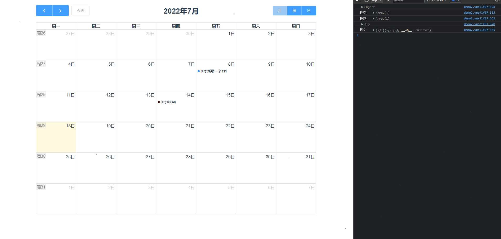
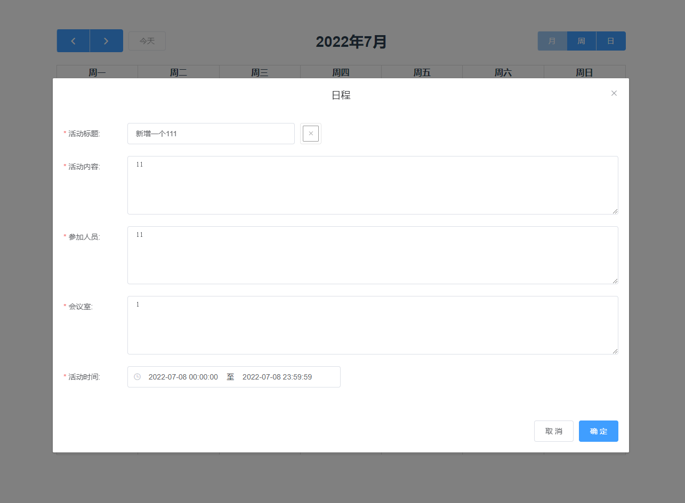
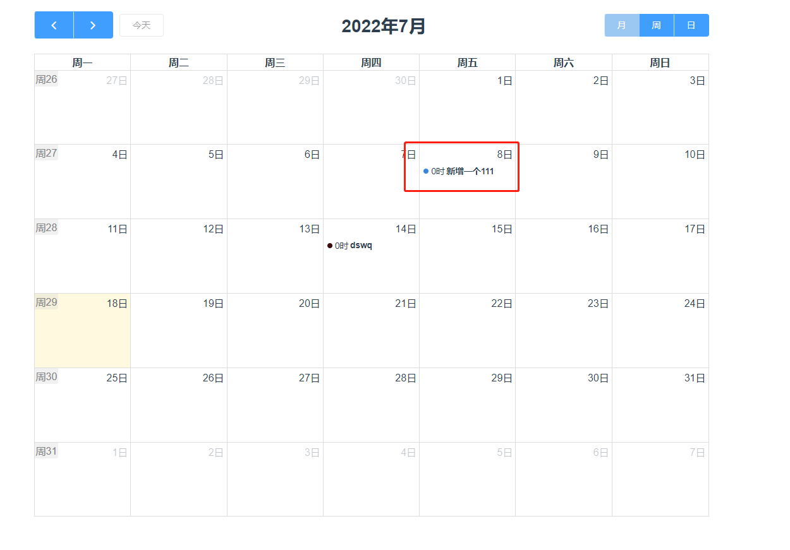

# vue-demo


# 操作流程
### 单机日程事项 -》 新增 or 更新
### 双击日程事项 -》 删除


# 演示





# 添加依赖 packge.json  dependencies

    "@fullcalendar/core": "^5.11.0",
    "@fullcalendar/daygrid": "^5.11.0",
    "@fullcalendar/interaction": "^5.11.0",
    "@fullcalendar/timegrid": "^5.11.0",
    "@fullcalendar/vue": "^5.11.0",
    "fullcalendar": "^3.10.2",
    "vue-full-calendar": "^2.8.1-0",
    "moment": "^2.29.4",
    "tippy.js": "^6.3.7",


## Project setup
```
npm install
```

### Compiles and hot-reloads for development
```
npm run serve
```

### Compiles and minifies for production
```
npm run build
```

### Lints and fixes files
```
npm run lint
```

### Customize configuration
See [Configuration Reference](https://cli.vuejs.org/config/).
